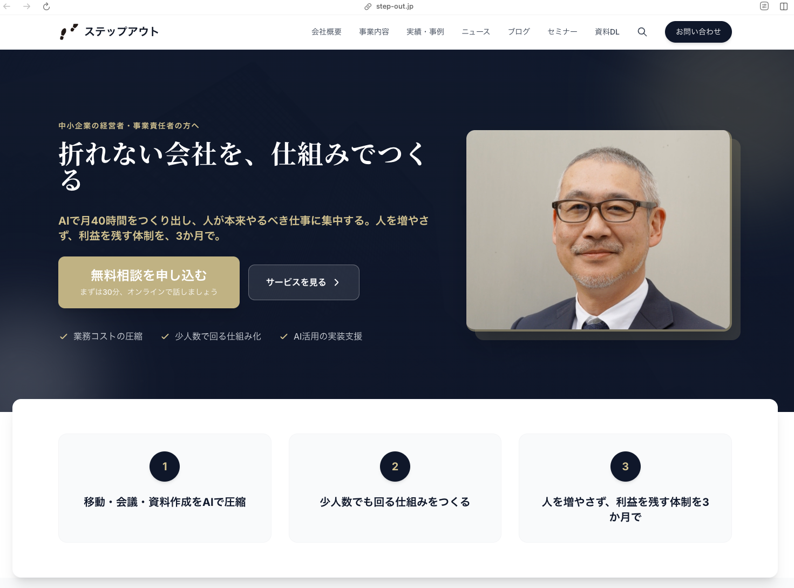

<!-- _class: title -->

# 倫理 × AI 実践セミナー

**草津市倫理法人会**
2026.3.17

---

<!-- _class: message -->

草津市倫理法人会 副専任幹事

今宿 裕昭

マツダ → 博報堂（29年）→ 独立 ステップアウトマーケティング合同会社 代表

コードは一行も書けません

この会社のサイトも、AIと二人で作りました

---

<!-- _class: message -->

---

<!-- _class: message -->

# 倫理を学んでいる人こそ、 AIを使いこなせる

「あり方」は倫理。「やり方」はAI。

---

<!-- _class: kpi-hero -->

# 中小企業のAI方針「未決定」

50.9%

東京商工リサーチ 2025年調査（6,645社）

---

<!-- _class: kpi-hero -->

# 大企業との活用格差

中小企業
23.4%

vs

大企業
43.3%

---

<!-- _class: kpi-hero -->

# AI導入を阻む壁

5つ

壁は「お金」でも「技術」でもない

---

<!-- _class: kpi-hero -->

# 壁① 怖い

68.5%

情報漏洩・失敗への不安

---

<!-- _class: kpi-hero -->

# 壁② 人がいない

55.1%

専門人材がいない

---

<!-- _class: kpi-hero -->

# 壁③ 決められない

50.9%

方針が決まらない

---

<!-- _class: kpi-hero -->

# 壁④ 判断できない

43.8%

良し悪しを評価できない

---

<!-- _class: kpi-hero -->

# 壁⑤ わからない

41.9%

何に使うかわからない

---

<!-- _class: message -->

# これだけの壁があれば、 使えなくて当然だった

---

<!-- _class: before-after -->

# 経営者の「あり方」が成果を分ける

<h3>経営者が理解していない</h3>

50%

しか効果を実感できない

<h3>経営者が理解している</h3>

95.5%

が効果を実感

BuddieS 2025年調査（111社）

---

<!-- _class: message -->

# 5つの壁の根っこは1つ。 「あり方」の不在

何のために経営しているか。何のために使うか。

---

<!-- _class: message -->

# 「あり方」は倫理。 「やり方」はAI。

わたしたちは「あり方」を日々磨いている

---

<!-- _class: message -->

# わたしたちは、 すでにハンドルを握れる人間だ

5つの壁を越える力は、栞の中にある

---

<!-- _class: message -->

---

<!-- _class: kpi-hero -->

WALL 1 / 怖い ― 68.5%が感じる壁

# 第15条： 信ずれば成り、憂えれば崩れる

<blockquote>
憂えて止まることが、最大のリスク。 
理解して踏み出した経営者の95.5%が効果を実感
</blockquote>

---

<!-- _class: kpi-hero -->

WALL 2 / 人がいない ― 55.1%が感じる壁

# 第4条： 人は鏡、万象はわが師

<blockquote>
人がいないなら、AIを師にする。 
学ぶ姿勢がある人に、AIは最大の力を返す
</blockquote>

---

<!-- _class: kpi-hero -->

WALL 3 / 決められない ― 50.9%が感じる壁

# 第1条： 今日は最良の一日、今は無二の好機

<blockquote>
「来月やろう」で3年が過ぎた。 
始める最良の日は、今日
</blockquote>

---

<!-- _class: kpi-hero -->

WALL 4 / 判断できない ― 43.8%が感じる壁

# 第3条： 運命は自らまねき、境遇は自ら造る

<blockquote>
自分の事業は自分で判断するしかない。 
やってみて初めてわかる
</blockquote>

---

<!-- _class: kpi-hero -->

WALL 5 / わからない ― 41.9%が感じる壁

# 第16条： 己を尊び人に及ぼす

<blockquote>
何に使うか？ 
自分を楽にし、それを人に及ぼすために使う
</blockquote>

---

<!-- _class: message -->

# 5つの壁を越える力が、 すでにわたしたちの中にある

栞の教えは、AI活用の土台そのものだった

---

<!-- _class: message -->

# 一人会社の社長には、 止めてくれる人がいない

案件の抜け漏れ、採算度外視、先送り…全部、自分では気づけない

---

# AIに「役職」を与えた

単なるチャットではない。**会社の経営構造として組み込んだ**

CEO

毎朝10秒で全案件の状態を把握

CFO

案件の採算を数字で判断・無理なら止める

PM

締切を管理し「やらないこと」を決める

取締役会

4視点で新規案件の受け入れを判断

---

# 毎朝5分で、会社が回る

1. 朝、スマホに**声で日記を録る**（ボイスジャーナル）
2. AIが案件別に自動振り分け → **PM取締役が起動**
3. 台帳の締切・カレンダーと突き合わせ
4. <strong>「今日やること3つ」と「今日やらないこと」</strong>が出る

朝の案件把握: 30分 → 5分

---

<!-- _class: message -->

# 孤独な判断が、なくなった

一番変わったのは、数字ではなく「意思決定の質」

---

<!-- _class: before-after -->

# 提案書の作成時間が6分の1に

<h3>Before</h3>

3時間

手作業で構成・執筆

<h3>After</h3>

30分

AIと対話で完成

---

<!-- _class: before-after -->

# メール1通あたり85%の時間削減

<h3>Before</h3>

20分

文面を一から作成

<h3>After</h3>

3分

AIが下書き→確認のみ

---

<!-- _class: before-after -->

# 議事録整理が5分で完了

<h3>Before</h3>

1時間

手動で書き起こし・整理

<h3>After</h3>

5分

AIが自動要約

---

<!-- _class: message -->

# AIを使うことは、 効率化ではない

生まれた時間を、大切なことに使う

---

<!-- _class: quote -->

# 己を尊び、人に及ぼす

<blockquote>
自分 → 家族 → 職場 → 地域 → 日本 
わたしたちの幸せが、波紋のように広がる
</blockquote>

---

<!-- _class: message -->

# 「私は実践する」と決めた瞬間から、 あなたは倫理AI実践士

仲間と一緒に、今日から始める

---

# ここからは「どうやって」の話

ここまでは<strong>「なぜ」と「何を」</strong>の話をしました

ここからは<strong>実際にAIを触って体験</strong>する時間です

<blockquote>
中野 充博 さんにバトンタッチします
</blockquote>

---

<!-- _class: closing -->

# わたしたちの周りの人を 幸せにする第一歩

**この後、中野さんの体験ワークで実際にAIを触ります**

---

<!-- _class: closing -->

# アンケートにご協力ください

スマートフォンで QRコードを読み取ってください

所要時間：約2分

